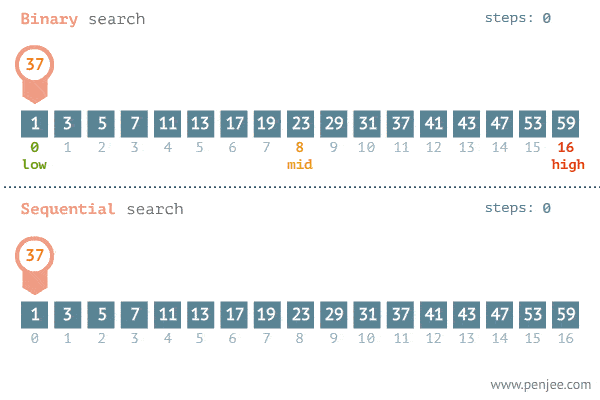

# Too Long Didn't Read Dictionary of Algorithms and Data Structures
> Repository dedicated to a breakdown of data structures and algorithms into short snippets and layman terms.
## Table of Contents

- [Time Complexity](#Time-Complexity )
  - [Big O](#Big-O)
  - [Big Omega](#Big-Omega)
  - [Big Theta](#Big-Theta)
- [Space Complexity](#Space-Complexity )
- [Algorithms](#Algorithms)
  - [Binary Search](#Binary-Search-)
- [Data Structures](#Data-Structures)
- [Contributing](#contributing)
- [License](#license)


## Time Complexity

Time complexity is the computational complexity that it takes for a program/function to iterate through the operations by the algorithms in that program.
### Big O
Big O specifcally describes the upper bound of time, or **best case scenario**.


> Refrence: https://www.bigocheatsheet.com/
### Big Omega
Big Omega descripes the opposite of Big O. It descripes the lowest bound of time, or **worst case scenario**.
### Big Theta


## Space Complexity

###
```
#TODO

```

## Algorithms

### Searching :

#### Binary Search :
##### Description: 
Also known as **half-interval search**, **logarithmic search**, or **binary chop**. It is a search algorithm that finds the positon of a target value within a **_sorted_** array.
##### Functionality:
Binary search performs a search comparing the target value against a pivot point (middle of the array) and divides the search space in 2 after every comparison. If they are not equal (middle of the array == target value) then you remove the half that the target value could not be in and perform the search again until the value is found. If the search ends with the remaining half being empty then the target is not in the array.



##### Performance:
+ Worst-Case time complexity:		O(log n)
+ Best-case time complexity:		Ω(1)
+ Worst-case space complexity:		O(1)


### Sorting :

#### Bubble Search :
##### Description: 
Also known as **sinking sort**. It is a sorting algorithm that loops through an array until it is sorted by swaping adjacent elements in either ascending or descending order.
##### Functionality:
You start looping through the array swapping elements based on if they are supposed to be in ascending or descending order. You keep passing through the list until it is sorted. The elements "bubble" to the top. The algroithm is slow and impractial for most problems.


##### Performance:
+ Worst-Case time complexity:		O(n^2)
+ Best-case time complexity:		Ω(n)
+ Worst-case space complexity:		O(1)


```
#TODO
```

## Data Structures

```
#TODO
```


## Contributing

If you'd like to contribute, please fork the repository and use a feature branch. Pull requests are warmly welcome.


## License

[MIT © Olaf Adrian Minkowicz.](LICENSE)